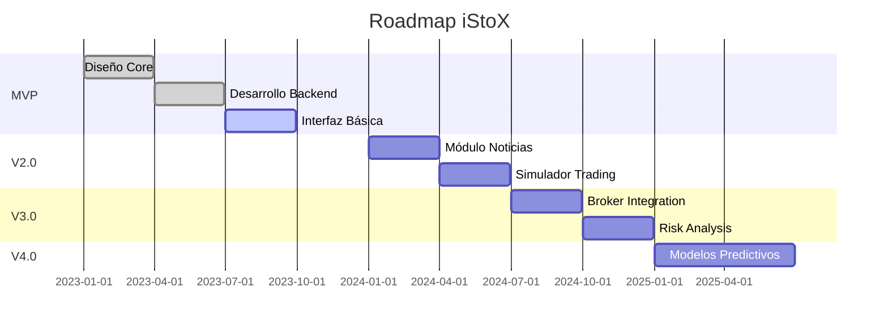

# iStoX - Análisis Bursátil Inteligente


## 📌 Descripción

iStoX es una aplicación avanzada para el análisis bursátil que permite calcular el **valor intrínseco** de acciones, compararlo con su valor de mercado y ofrecer herramientas profesionales para inversores. La aplicación integra múltiples fuentes de datos financieros con un sistema robusto de fallback para garantizar disponibilidad continua.

## ✨ Características Principales

- 📊 **Cálculo del Valor Intrínseco**: Métodos DCF y múltiplos comparativos
- 📈 **Visualización Interactiva**: Gráficos comparativos históricos
- 🛡️ **Sistema de Fallback**: 7 APIs financieras integradas con gestión inteligente
- 🤖 **Análisis Técnico**: Detección automática de soportes/resistencias
- 💼 **Gestión de Portafolio**: Seguimiento y análisis de inversiones
- 🧠 **Recomendaciones Inteligentes**: Basadas en valor intrínseco e indicadores técnicos
- 🗞️ **Análisis de Sentimiento**: Procesamiento de noticias financieras
- 📱 **Integración con Redes Sociales**: Tendencias de Twitter/Reddit
- 🎮 **Simulador de Trading**: Practica sin riesgo
- 📑 **Informes Personalizables**: Exporta a PDF/Excel
- 🔒 **Integración con Brokers**: Sincronización con cuentas reales

## 🛠️ Stack Tecnológico

### Backend
- **Python 3.9+**
- **Librerías Principales**:
  - Pandas (análisis de datos)
  - NumPy (cálculos financieros)
  - Streamlit (interfaz web)
  - Plotly/Matplotlib (visualizaciones)

### APIs Integradas
- Yahoo Finance (yfinance)
- Alpha Vantage
- Finnhub
- Tiingo
- IEX Cloud
- Marketstack
- Polygon.io
- Quandl

### Almacenamiento
- **SQLite/Redis**: Sistema de caché para datos financieros
- **Sistema de Archivos**: Almacenamiento local de datos históricos

## 🚀 Instalación

1. Clonar el repositorio:
```bash
git clone https://github.com/tu_usuario/iStoX.git
cd iStoX
```

2. Crear entorno virtual:
```bash
python -m venv venv
source venv/bin/activate  # Linux/Mac
venv\Scripts\activate    # Windows
```

3. Instalar dependencias:
```bash
pip install -r requirements.txt
```

4. Configurar variables de entorno:
```bash
cp .env.example .env
```
Editar el archivo `.env` con tus claves API.

5. Ejecutar la aplicación:
```bash
streamlit run app.py
```

## 🏗️ Estructura del Proyecto

```
iStoX/
├── app.py                  # Aplicación principal
├── modules/                # Módulos funcionales
│   ├── data_fetcher.py     # Obtención de datos
│   ├── valuation.py        # Cálculos de valoración
│   ├── technical.py        # Análisis técnico
│   ├── portfolio.py        # Gestión de portafolio
│   ├── news_sentiment.py   # Análisis de noticias
│   ├── social.py           # Redes sociales
│   ├── simulator.py        # Simulador trading
│   ├── reports.py          # Generación de informes
│   ├── risk.py             # Análisis de riesgo
│   └── api_fallback.py     # Sistema de fallback
├── cache/                  # Datos en caché
├── assets/                 # Recursos estáticos
├── docs/                   # Documentación
└── tests/                  # Pruebas unitarias
```

## 🔍 Ejemplo de Uso

1. Ingresar ticker (ej: "AAPL")
2. Seleccionar método de valuación (DCF/Múltiplos)
3. Ajustar parámetros según necesidad
4. Explorar las diferentes pestañas:
   - Análisis técnico
   - Portafolio
   - Recomendaciones
   - Noticias y redes sociales
   - Simulador de trading
   - Análisis de riesgo

## 📈 Sistema de Fallback para APIs

iStoX implementa un sistema inteligente de gestión de APIs que:
1. Prioriza APIs según disponibilidad y límites
2. Utiliza caché agresivo para minimizar llamadas
3. Combina datos de múltiples fuentes cuando es necesario
4. Monitorea el rendimiento de cada API
5. Notifica cuando se usan APIs de menor prioridad

```python
API_PRIORITY_LIST = [
    {'name': 'alpha_vantage', 'daily_limit': 500},
    {'name': 'finnhub', 'minute_limit': 60},
    {'name': 'tiingo', 'hour_limit': 500},
    # ... otras APIs
]
```

## 🤝 Contribuciones

¡Las contribuciones son bienvenidas! Por favor:
1. Abre un issue para discutir el cambio propuesto
2. Haz fork del repositorio
3. Crea una rama para tu feature (`git checkout -b feature/AmazingFeature`)
4. Haz commit de tus cambios (`git commit -m 'Add some AmazingFeature'`)
5. Push a la rama (`git push origin feature/AmazingFeature`)
6. Abre un Pull Request

## 📜 Licencia

Distribuido bajo licencia MIT. Ver `LICENSE` para más información.

## ✉️ Contacto

Equipo de Desarrollo iStoX - [email@example.com](mailto:email@example.com)

---

# 🗺️ Roadmap de iStoX

## 🚦 Fase Actual: MVP (Versión 1.0)
**Fecha estimada: Q4 2023**  
✅ **Funcionalidades completadas:**
- Cálculo básico de valor intrínseco (DCF)
- Integración con Yahoo Finance
- Gráficos comparativos simples
- Sistema básico de caché

🛠 **En desarrollo:**
- Sistema de fallback para APIs (80% completado)
- Módulo de análisis técnico (soportes/resistencias)
- Interfaz de portafolio básica

## 🌟 Fase 2: Versión 2.0 (Análisis Avanzado)
**Fecha estimada: Q2 2024**  
📌 **Objetivos:**
- [ ] Integración completa de 7 APIs financieras con fallback automático
- [ ] Análisis de sentimiento en noticias (NLP)
- [ ] Módulo de redes sociales (Twitter/Reddit)
- [ ] Simulador de trading básico
- [ ] Exportación de informes en PDF

## 🔮 Fase 3: Versión 3.0 (Professional Tools)
**Fecha estimada: Q4 2024**  
📌 **Objetivos:**
- [ ] Integración con brokers populares (OAuth)
- [ ] Análisis de riesgo avanzado (VaR, CVaR)
- [ ] Alertas personalizables
- [ ] Backtesting de estrategias
- [ ] Dashboard institucional

## 🚀 Fase 4: Versión 4.0 (Machine Learning)
**Fecha estimada: 2025**  
📌 **Objetivos:**
- [ ] Modelos predictivos con ML
- [ ] Análisis de patrones gráficos con visión por computadora
- [ ] Recomendaciones personalizadas con IA
- [ ] Integración con asistentes virtuales (Alexa/Google Assistant)

## 📅 Cronograma Visual



## 🔄 Proceso de Desarrollo

1. **Sprints de 2 semanas** con entregables definidos
2. **Priorización basada en feedback** de usuarios beta
3. **Pruebas rigurosas** antes de cada release
4. **Documentación continua** de cada feature

## 🤝 Cómo Contribuir

¿Quieres ayudar a acelerar el desarrollo? Puedes:
1. Reportar bugs o sugerir features en Issues
2. Contribuir código en áreas prioritarias:
   - Sistema de caché distribuido
   - Integración con APIs adicionales
   - Mejoras en visualizaciones
3. Donar recursos de API (claves con límites elevados)

## 📌 Notas Adicionales

- Las fechas son estimaciones y pueden ajustarse
- Features marcados con ⚡ son "game changers" prioritarios
- Versión móvil planeada para 2025

¿Interesado en probar versiones beta? ¡Contáctanos!
